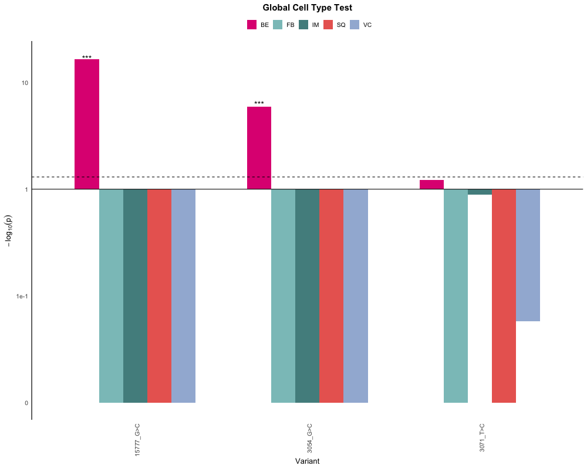
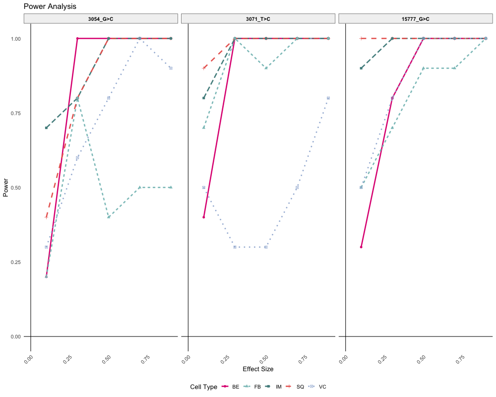

```{r setup, include=FALSE}
knitr::opts_chunk$set(echo = T)
#knitr::opts_knit$set(root.dir = "~/Documents/GitHub/SpatialMT/")
```

### Step 1: Load example data

In this step, we want to load data required for ***SUMMIT***. Our example data in this tutorial comes from a Barrett's Esophagus patient, and is available at [DropBox](https://www.dropbox.com/scl/fo/sx6tfijkkapsvo4036xhj/AB9NjFsN6yz5xYyz-CpAgKk?rlkey=kf6blkddohhd7gdr96q85kf21&st=sybpv5mx&dl=0). Please download the files and move them to the **SpatialMT/examples/example_data** folder or a specified path.

To prepare your own data as SUMMIT input format:

-   From fastq/bam files to MT alternative allele count matrix **X** and coverage matrix **N**, please check [maegatk](https://github.com/caleblareau/maegatk) [1] for pre-processing.

-   For filtering the initial list of variant of interest (voi), please check [maegatk](https://github.com/caleblareau/maegatk) [1] for pre-processing. Or the variants could be through differnt QCs of filtering. We also have analysis scripts under the Analysis folder.

-   For celltype ratio ***W***, we utilized [RCTD](https://github.com/dmcable/spacexr) [2] for celltype decomposition.

First let's load relevant packages and functions. The **210215_FunctionsGeneral.R** is a utility function of MAESTER [1] to load the pre-processed variant count matrix.

```{r STEP1_lib, eval=F}
library(SpatialMT)
library(grid)
library(gridExtra)
library(spacexr) # RCTD
library(dplyr)
library(ggplot2)
library(Seurat)

setwd("~/Documents/GitHub/SpatialMT/examples/")
source("utility_prev_literature/210215_FunctionsGeneral.R") # from MAESTER paper
```

Load the Spatial Transcriptomics (ST) data:

```{r STEP1_load_ST_data, eval=F}
# load Spatial Transcriptomics/Curio Seeker data
seu <-readRDS("example_data/a200_s6_final.rds")
# obtain spatial coordinates
spatial_coords = seu@reductions$SPATIAL@cell.embeddings
```

Load the mtDNA data of alternative allele count matrix and coverage matrix from MAESTER, and variant of interest:

```{r STEP1_load_MT_data, eval=F}
# load MT data
maegatk.rse = readRDS("example_data//maegatk_mr1.rds")
# all possible mitochodnrial mutations' (4* 16K) x spot' VAF
af.dm <- data.matrix(computeAFMutMatrix(maegatk.rse)) # 0-1 VAF scale
# prepare coverage N, # spot x each chrM location's (16K) coverage
counts=as.matrix(maegatk.rse @assays@data$coverage)
rownames(counts) = 1:nrow(counts);
colnames(counts) = maegatk.rse @colData@rownames
N=as(as.matrix(counts[sapply(strsplit(rownames(af.dm),"_"),"[[",1),]), "sparseMatrix")
rownames(N) <- rownames(af.dm)

# load variant of interest
voi =  c("3054_G>C","15777_G>C","3071_T>C")

# subset to matrix to be much smaller sizes
af.dm=af.dm[voi,]
N = N[voi,]
N = N[,colnames(af.dm)]
```

Load decomposed cell type ratio from tools like RCTD:

-   For this sample, we used the [Barrett's Esaphugus scRNA-Seq atlas](https://www.biorxiv.org/content/10.1101/2023.01.26.525564v2) [3] as the reference dataset for cell type decomposition. For your own dataset, public atlas of the same disease type could be used to obtain cell type ratio matrix ***W***.

```{r STEP1_load_celltype_ratio, eval=F}
# Load RCTD ratio
rctd_ratio_major = readRDS("example_data//RCTD_res.rds")
# normalize the celltype weights to sum to 1 in each spot
rctd_ratio_major = as.data.frame(as.matrix(normalize_weights(rctd_ratio_major@results$weights))) 
rownames(rctd_ratio_major) = paste0(rownames(rctd_ratio_major),"-1")
Ws = rctd_ratio_major[colnames(af.dm),]
celltypes= colnames(Ws)
```

### Step 2: Global Cell Type Test for Association of Variant with Cell Type

#### Model Explaination

We describe here the model underlying the statistical test that cell type $k$ is co-enriched with variant $j$. Co-enrichment means that we expect a proportion of cells from cell type $k$ to be carriers for the variant $j$.

For variant $j$, let $\theta_{0j}$ represent its background VAF, that is, the probability of a read carrying the alternative allele of the variant within a spot that does not carry it. Background VAF quantifies the false positive rate of calling a variant. Let $\theta_{1j}$ represent the expected VAF within carrier cells, that is, the heteroplasy proportion.

For celltype $k \in \{1,2, … , K\}$, we let $\pi_{jk}$ be the proportion of cells within the cell type that carry variant $j$. Our null hypothesis is thus: $$H_{0k}: \pi_{jk} = 0 (1)$$ versus the alternative that $\pi_{jk} > 0$.

Within spot $s$, let $W_{sk}$ be the proportion of cell type $k$ estimated via deconvolution. We start by defining latent variable $Z_{sij}$, the allele on read $i$ mapping to spot $s$ for variant $j$. $Z_{sij}$ is unobserved in our data, but has the distribution: $$Z_{isj} \sim (1- W_{sk}) Bernouli(\theta_0j )+ W_{sk} (1-\pi_{kj} )Bernouli(\theta_0j )+ W_{sk}\pi_{kj} Bernouli(\theta_{1j})$$ $$=(1-W_{sk}\pi_{kj} )Bernouli(\theta_{0j} ) + W_{sk} \pi_{kj}  Bernouli(\theta_{1j})$$.

That is, if the read comes from cell type $k$ (with probability $W_{sk}$), then it has probability $\pi_{jk}$ of being a carrier of the variant. If it were the carrier of the variant, then it has probability $\theta_{1j}$ of containing the alternative allele. If we assume, for the purpose of this hypothesis test, that cell type $k$ is the only possible carrier cell type, then in all other cases read i would carry the alternative allele with background probability $\theta_{0j}$. Summing up the reads that map to spot s, we have the distribution for X_sj, alternative allele counts in spot s:

$$X_{sj}∼(1-W_{sk} \pi_{kj} )Binomial(\theta_{0j} )+ W_{sk} \pi_{kj} Binomial(\theta_1j)$$

We take the expectation of both sides of the above, and rearrange to get: $$E[\frac{X_{sj}}{N_{sj}} ]=\theta_{0kj} + \pi_{kj}(\theta_{1j} - \theta_{0j} ) W_{sk} (2)$$.

We make the reasonable assumption that $\theta_{1j} > \theta_{0j}$, that is, the expected carrier VAF is strictly greater than the background VAF, then our null hypothesis (1) is equivalent to the slope $\pi_{kj}(\theta_{1j}-\theta_{0j} )=0$ in the above linear model. We can estimate this slope through a (weighted) linear regression of the observed VAFs $\frac{X_{sj}}{N_{sj}}$ on $W_{sk}$, weighted by coverage $N_{sj}$. We say that variant $j$ is significantly co-enriched with cell type $k$ if the slope in this regression is significantly positive, i.e. p-value less than a preset threshold and positive estimated value. We performed this regression test for each detected mitochondrial variant, after quality filtering, and controlled the FDR at 0.05 through Benjamini Hochberg procedure.

#### Code

The global celltype test could be performed with function `celltype_test`:

The raw p-values are adjusted for multiple hypothesis testing (#variants x #celltypes), by specifying the `method="FDR"` parameter. - We also have permutation based (default 1000 permutations, with p-val at 0.001 resolution), coverage-weighted linear regression, by setting `test_type = "weighted"`.

```{r STEP2_test, eval=F}
# To save results
save_path = paste0("example_data/results")
dir.create(save_path)

# global celltype test
res_lg = celltype_test(celltypes = celltypes,voi=voi,N=as.matrix(N),
                       vaf=as.matrix(af.dm), Ws=Ws, spatial_coords = spatial_coords,
                       test_type = "linear",plot=T,
                       save_path=save_path,method="FDR",
                       figure_height = 15, figure_width = 15)
```

To perform paired power analysis:

```{r STEP2_beta, eval=F}
beta_list = power_analysis_all(voi=voi,celltypes = celltypes,Ws=Ws,
                               N=N,vaf=af.dm,X=NULL,
                               sample_num=100,alpha=0.05,n_sim=10,
                               beta_threshold =0.5,plot=T,save_path = save_path)
```

We can visualize such global significance results as in our paper in specified celltypes. - `celltypes` could be set to be subtypes and only showing subtypes. - `celltype_colors` allows customization of coloring.

```{r STEP2_result_visualization, include=T,eval=F}
# Visualize significance
celltype_colors = c("BE" = "#E00A82","SQ" = "#ea6860","IM" = "#538e8e","FB" = "#8bc3c3","VC" = "#a2b7d7")
celltypes = c("BE" ,"SQ" ,"IM","FB","VC")
p<- plot_lineage_significance(
  res = res_lg,
  celltypes=celltypes,
  fill_values=celltype_colors,
  order_by = "BE",
  title="Global Cell Type Test",
  outfile = file.path(save_path, "lineage_significance_allcelltype.pdf"),
  return_plot=T
)
# Visualize the result
print(p)
```

\#

Visualizing the detection power at different fitted coefficient:

```{r STEP2_result_visualization_power, include=T,eval=F}
celltype_pattern = paste(celltypes,collapse = "|")
effect_sizes = seq(0.1, 1, by = 0.2)
plot_power_curves(
  beta_list = beta_list,
  effect_sizes = effect_sizes,
  celltype_pattern=celltype_patterns,
  desired_order = c("3054_G>C","3071_T>C","15777_G>C"),
  save_pdf = TRUE,
  save_path = save_path,
  file_name = "Power_curve.pdf",
  return_plot=T
)
print(p2)
```


### Step 3: Localized Cell Type Test

The localized celltype test could be performed with fucntion `celltype_test_knn`:

-   The spot-level p-values could be adjusted by FDR for multiple hypothesis corrections.
-   `exclude_plot_idx` is an important parameter. We want to pair the local test with a group of control cells,, but the spots with too high proportion of cell type of interest (such as tumor/diseased cells) shall be excluded. 

```{r STEP3, eval=F}
# load data (X - alternate allele counts, N - total counts, Ws - celltype)
common_cells <- intersect(intersect(colnames(N), rownames(Ws)), 
                          rownames(spatial_coords))
Ws = Ws[common_cells,]
spatial_coords=spatial_coords[common_cells,]

exclude_plot_idx = rownames(Ws)[Ws$BE < 0.25]

pdf(paste0(save_path,"/spot_level_significance.pdf"),width=15,height=15)
for(var in voi){
  print(var)
  sample_idx = intersect(rownames(Ws)[(Ws$BE < 0.25)],
                         colnames(N)[N[var,] > 1])
  result_var=celltype_test_knn(celltypes,vars=c(var),
                               N_voi=N[var,,drop=F],vaf=af.dm[var,,drop=F],
                               Ws,spatial_coords,
                               test_type="linear",k_neighbors=100,
                               method="Raw",sample_idx=sample_idx,disease_celltype = "BE",
                               ratio_threshold=0.02,exclude_plot_idx = exclude_plot_idx,
                               vaf_cellprop = F,coef_plot_option = "negative")
  saveRDS(result_var,paste0(save_path,"/",var,"_spot_test.rds"))
  print(result_var$combined_plot)
}
dev.off()
```

```{r model_overview_local, include=FALSE, eval=F}
### Step 0: Model Explanation (TODO)
# include model structure here
# insert model pictures
# include math derivation
```

### Step 4: Other statistics

```{r step4,  eval=F}
### Step 0: Model Explanation (TODO)
# include model structure here
# insert model pictures
# include math derivation
```

```{r metric_overview_lisi_moran, include=FALSE, eval=F}
### Step 0: Model Explanation (TODO)
# include model structure here
# insert model pictures
# include math derivation
```

### References

[1] Miller, T.E., Lareau, C.A., Verga, J.A. et al. Mitochondrial variant enrichment from high-throughput single-cell RNA sequencing resolves clonal populations. Nat Biotechnol 40, 1030--1034 (2022). <https://doi.org/10.1038/s41587-022-01210-8>

[2] Cable, Dylan M., et al. "Robust decomposition of cell type mixtures in spatial transcriptomics." Nature Biotechnology 40.4 (2022): 517-526.

[3] Rodrigo A. Gier, Raúl A. Reyes Hueros, Jiazhen Rong, Maureen DeMarshall, Tatiana A.Karakasheva, Amanda B. Muir, Gary W. Falk, Nancy R. Zhang, Sydney M. Shaffer. "Clonal cell states link Barrett's esophagus and esophageal adenocarcinoma." bioRxiv 2023.01.26.525564; doi: <https://doi.org/10.1101/2023.01.26.525564>
